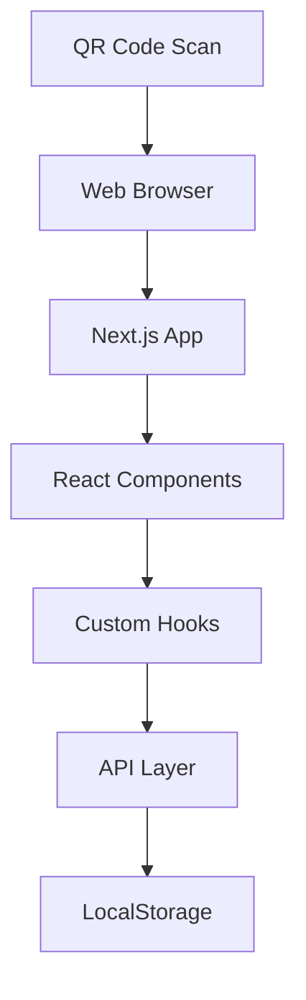
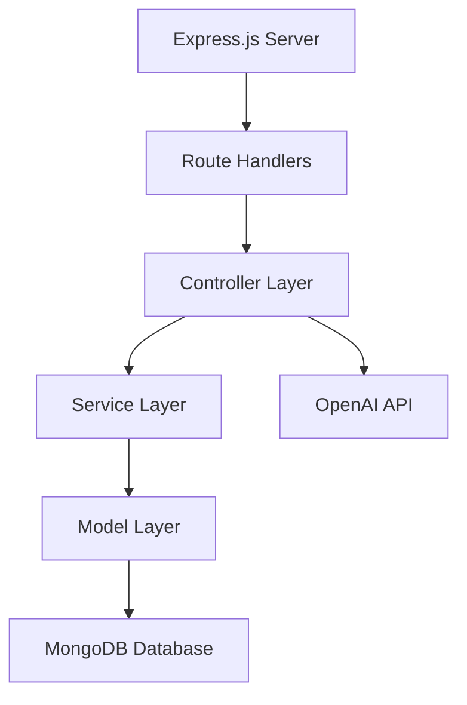
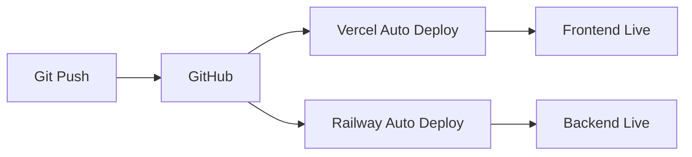

# EduChat AI 학습 시스템 - 기술 문서
## 🏗️ 시스템 아키텍처 및 기술 명세

---

## 📋 목차
1. [시스템 개요](#시스템-개요)
2. [아키텍처 구조](#아키텍처-구조)
3. [기술 스택](#기술-스택)
4. [데이터베이스 설계](#데이터베이스-설계)
5. [API 명세](#api-명세)
6. [보안 및 성능](#보안-및-성능)
7. [배포 및 인프라](#배포-및-인프라)
8. [개발 환경](#개발-환경)

---

## 🎯 시스템 개요

### 핵심 아키텍처
```
[학생 디바이스] ←→ [Frontend] ←→ [Backend API] ←→ [MongoDB]
                              ↓
                         [OpenAI API]
```

### 시스템 구성 요소

- **Frontend**: Next.js 기반 React 웹 애플리케이션
- **Backend**: Express.js 기반 RESTful API 서버
- **Database**: MongoDB Atlas (클라우드 데이터베이스)
- **AI Engine**: OpenAI GPT 모델 통합
- **Storage**: 클라이언트 사이드 localStorage (채팅 데이터)

---

## 🏗️ 아키텍처 구조

### 📱 **Client-Side Architecture**



#### 주요 컴포넌트
- **Chat Interface**: 실시간 메시지 교환 UI
- **Admin Dashboard**: 관리자 콘텐츠 관리 인터페이스
- **QR Code Router**: QR 코드 기반 라우팅 시스템

### 🖥️ **Server-Side Architecture**



#### 레이어 구조
- **Route Layer**: HTTP 엔드포인트 정의
- **Controller Layer**: 비즈니스 로직 처리
- **Service Layer**: 외부 API 통합 (OpenAI)
- **Model Layer**: 데이터 스키마 및 검증
- **Database Layer**: MongoDB 데이터 영속성

---

## 💻 기술 스택

### **Frontend Stack**
```yaml
Framework: Next.js 15.3.5
Language: TypeScript 5.x
UI Library: React 18.x
Styling: Tailwind CSS 3.x
Icons: Lucide React
Markdown: ReactMarkdown
State Management: React Hooks + Custom Hooks
HTTP Client: Fetch API
```

### **Backend Stack**
```yaml
Runtime: Node.js 18.x+
Framework: Express.js 4.x
Language: TypeScript 5.x
Database ODM: Mongoose 8.x
Authentication: Custom middleware
Validation: Mongoose built-in validators
AI Integration: OpenAI API 4.x
Environment: dotenv
```

### **Database & Infrastructure**
```yaml
Database: MongoDB Atlas (Cloud)
File Storage: Local filesystem (QR codes)
CDN: Vercel Edge Network
Container: Railway (Backend hosting)
Monitoring: Built-in logging
```

---

## 🗄️ 데이터베이스 설계

### **Core Collections**

#### 📚 **Textbooks** (교재)
```typescript
interface ITextbook {
  _id: ObjectId;
  title: string;          // 교재명
  publisher: string;      // 출판사
  subject: string;        // 과목 (국어, 문학 등)
  level: string;          // 학년 (고1, 고2, 고3)
  grade: string;          // 학기
  createdAt: Date;
  updatedAt: Date;
}
```

#### 📄 **PassageSets** (지문세트)
```typescript
interface IPassageSet {
  _id: ObjectId;
  title: string;               // 지문 제목
  passage: string;             // 지문 내용
  passageComment: string;      // 지문 해설
  qrCode: string;             // 고유 QR 코드 (6자리)
  textbooks: ObjectId[];      // 연결된 교재들
  createdAt: Date;
  updatedAt: Date;
}
```

#### ❓ **Questions** (문제)
```typescript
interface IQuestion {
  _id: ObjectId;
  setId: ObjectId;            // 지문세트 참조
  questionNumber: number;     // 문제 번호
  questionText: string;       // 문제 내용
  options: string[];          // 선택지 배열
  correctAnswer: string;      // 정답
  explanation: string;        // 해설 (마크다운)
  createdAt: Date;
  updatedAt: Date;
}
```

#### 🤖 **SystemPrompts** (시스템 프롬프트)
```typescript
interface ISystemPrompt {
  _id: ObjectId;
  key: string;               // 프롬프트 식별자
  name: string;              // 표시명
  description: string;       // 설명
  content: string;           // 프롬프트 내용
  isActive: boolean;         // 활성화 여부
  version: number;           // 버전 번호
  createdAt: Date;
  updatedAt: Date;
}
```

#### 📝 **SystemPromptVersions** (프롬프트 버전 히스토리)
```typescript
interface ISystemPromptVersion {
  _id: ObjectId;
  promptKey: string;         // 원본 프롬프트 키
  content: string;           // 해당 버전 내용
  version: number;           // 버전 번호
  description: string;       // 버전 설명
  createdBy: string;         // 생성자
  createdAt: Date;
}
```

### **Indexes**
```javascript
// 성능 최적화를 위한 인덱스
db.passagesets.createIndex({ "qrCode": 1 }, { unique: true });
db.questions.createIndex({ "setId": 1, "questionNumber": 1 }, { unique: true });
db.systemprompts.createIndex({ "key": 1, "isActive": 1 });
db.systemprompversions.createIndex({ "promptKey": 1, "version": -1 });
```

---

## 🔌 API 명세

### **Base URL**
```
Production: https://yuriaichatbot-production-1f9d.up.railway.app/api
Development: http://localhost:3001/api
```

### **Core Endpoints**

#### 🗣️ **Chat API**
```http
POST /chat/:qrCode
Content-Type: application/json

{
  "message": "사용자 질문"
}

Response:
{
  "success": true,
  "data": {
    "response": "AI 응답 메시지"
  }
}
```

#### 📊 **Admin Dashboard API**
```http
GET /admin/dashboard/stats
Response:
{
  "success": true,
  "data": {
    "stats": [
      {
        "name": "총 교재",
        "value": "12",
        "change": "+2",
        "changeType": "positive"
      }
    ]
  }
}

GET /admin/dashboard/recent-activity
Response:
{
  "success": true,
  "data": {
    "activities": [
      {
        "type": "textbook",
        "action": "created",
        "title": "고등 문학",
        "timestamp": "2025-07-12T10:30:00Z",
        "description": "새 교재 \"고등 문학\" 추가됨"
      }
    ]
  }
}
```

#### 📚 **Content Management APIs**

**교재 관리**
```http
GET    /admin/textbooks           # 교재 목록 조회
POST   /admin/textbooks           # 새 교재 생성
GET    /admin/textbooks/:id       # 특정 교재 조회
PUT    /admin/textbooks/:id       # 교재 수정
DELETE /admin/textbooks/:id       # 교재 삭제
```

**지문세트 관리**
```http
GET    /admin/passage-sets         # 지문세트 목록
POST   /admin/passage-sets         # 새 지문세트 생성
GET    /admin/passage-sets/:id     # 특정 지문세트 조회
PUT    /admin/passage-sets/:id     # 지문세트 수정
DELETE /admin/passage-sets/:id     # 지문세트 삭제
POST   /admin/passage-sets/:id/regenerate-qr  # QR 코드 재생성
```

**문제 관리**
```http
GET    /admin/sets/:setId/questions    # 지문세트별 문제 목록
POST   /admin/sets/:setId/questions    # 새 문제 생성
PUT    /admin/questions/:id            # 문제 수정
DELETE /admin/questions/:id            # 문제 삭제
```

#### 🤖 **AI Content Generation APIs**
```http
POST /admin/commentary-generator/generate
Content-Type: application/json

{
  "title": "지문 제목",
  "passage": "지문 내용",
  "existingCommentary": "기존 해설 (선택)",
  "subject": "국어",
  "level": "고등학교"
}

POST /admin/commentary-generator/generate-question
Content-Type: application/json

{
  "passageContent": "지문 내용",
  "questionText": "문제 내용",
  "options": ["선택지1", "선택지2", "선택지3", "선택지4"],
  "correctAnswer": "정답",
  "existingExplanation": "기존 해설 (선택)"
}
```

#### ⚙️ **System Prompt Management**
```http
GET    /admin/system-prompts                    # 프롬프트 목록
PUT    /admin/system-prompts/:id                # 프롬프트 수정
GET    /admin/system-prompts/versions/:key      # 버전 히스토리
POST   /admin/system-prompts/revert/:key        # 버전 되돌리기
```

---

## 🔐 보안 및 성능

### **보안 조치**

#### API 보안
```typescript
// CORS 설정
app.use(cors({
  origin: process.env.FRONTEND_URL,
  credentials: true
}));

// Rate Limiting (미구현)
// Helmet 보안 헤더 (미구현)
// API Key 인증 (OpenAI만 적용)
```

#### 데이터 보안
- MongoDB Atlas 암호화 연결
- 환경 변수를 통한 민감 정보 관리
- 클라이언트 사이드 채팅 데이터 저장 (개인정보 미수집)

### **성능 최적화**

#### 프론트엔드
```typescript
// Next.js 최적화
- Static Site Generation (SSG)
- Code Splitting
- Image Optimization
- Lazy Loading

// 사용자 경험
- Loading States
- Error Boundaries
- Optimistic Updates
```

#### 백엔드
```typescript
// MongoDB 최적화
- 인덱스 활용
- Aggregation Pipeline
- Connection Pooling

// API 성능
- Response Compression
- Caching Headers
- Pagination
```

---

## 🚀 배포 및 인프라

### **Production Environment**

#### Frontend Deployment (Vercel)
```yaml
Platform: Vercel
Domain: https://yuriaichatbot-frontend.vercel.app
Features:
  - Automatic Git deployment
  - Edge Network CDN
  - Serverless Functions
  - SSL Certificate
```

#### Backend Deployment (Railway)
```yaml
Platform: Railway
Domain: https://yuriaichatbot-production-1f9d.up.railway.app
Features:
  - Container-based deployment
  - Auto-scaling
  - Environment variables
  - SSL Certificate
```

#### Database (MongoDB Atlas)
```yaml
Provider: MongoDB Atlas
Cluster: M0 Sandbox (Free Tier)
Region: AWS ap-southeast-1 (Singapore)
Features:
  - Automatic backups
  - SSL encryption
  - IP whitelist security
```

### **CI/CD Pipeline**


---

## 🛠️ 개발 환경

### **Local Setup**
```bash
# 프로젝트 클론
git clone https://github.com/jjhmonolith/yuriaichatbot.git

# 백엔드 설정
cd backend
npm install
cp .env.example .env  # 환경 변수 설정
npm run dev

# 프론트엔드 설정
cd ../frontend
npm install
cp .env.local.example .env.local  # 환경 변수 설정
npm run dev
```

### **환경 변수**

#### Backend (.env)
```bash
PORT=3001
MONGODB_URI=mongodb+srv://...
OPENAI_API_KEY=sk-...
FRONTEND_URL=http://localhost:3000
NODE_ENV=development
```

#### Frontend (.env.local)
```bash
NEXT_PUBLIC_API_URL=http://localhost:3001/api
```

### **개발 도구**
```yaml
IDE: VS Code (권장)
Extensions:
  - TypeScript
  - Tailwind CSS IntelliSense
  - MongoDB for VS Code
  - REST Client

Package Managers:
  - npm (프론트엔드/백엔드)
  
Version Control:
  - Git + GitHub
```

---

## 📊 모니터링 및 로깅

### **로깅 시스템**
```typescript
// Backend Logging
console.log() // 기본 콘솔 로깅
// Production: Railway 내장 로깅 시스템

// Frontend Logging
console.error() // 에러 로깅
// Production: 브라우저 개발자 도구
```

### **성능 모니터링**
```yaml
Frontend:
  - Vercel Analytics (기본)
  - Core Web Vitals 추적

Backend:
  - Railway 내장 메트릭
  - API 응답 시간 측정
  - 에러율 추적
```

---

## 🔄 확장 계획

### **단기 계획 (3개월)**
- 사용자 인증 시스템 구현
- 채팅 로그 서버 저장
- 학습 분석 대시보드

### **중기 계획 (6개월)**
- 다중 과목 지원 (영어, 수학)
- 모바일 앱 개발
- 고급 AI 모델 통합

### **장기 계획 (1년)**
- 머신러닝 기반 개인화
- 실시간 협업 기능
- 교육기관 연동 API

---

## 📞 기술 지원

### **문서 및 리소스**
- GitHub Repository: https://github.com/jjhmonolith/yuriaichatbot
- API Documentation: /docs/api-spec.md
- Deployment Guide: /docs/deployment.md

### **연락처**
- 기술 책임자: 개발팀
- 이메일: dev@educhat.kr
- 이슈 트래킹: GitHub Issues

---

*EduChat AI 시스템의 기술적 세부사항에 대해 추가 문의사항이 있으시면 언제든 연락해 주세요.* 🚀