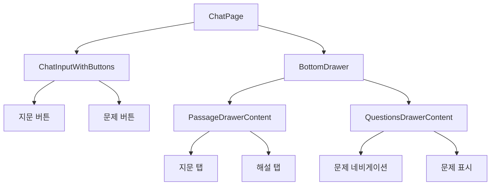

# EduChat AI 학습 시스템 - 기술 문서
## 🏗️ 시스템 아키텍처 및 기술 명세

> **업데이트**: 2025-01-17 | **버전**: 3.0 | **실제 배포 운영 중**

---

## 📋 목차
1. [시스템 개요](#시스템-개요)
2. [아키텍처 구조](#아키텍처-구조)
3. [기술 스택](#기술-스택)
4. [데이터베이스 설계](#데이터베이스-설계)
5. [API 명세](#api-명세)
6. [보안 및 성능](#보안-및-성능)
7. [배포 및 인프라](#배포-및-인프라)
8. [개발 환경](#개발-환경)
9. [운영 현황](#운영-현황)
10. [최신 기능](#최신-기능)

---

## 🎯 시스템 개요

### 핵심 아키텍처
```
[학생 디바이스] ←→ [Vercel Edge] ←→ [Railway Container] ←→ [MongoDB Atlas]
                              ↓
                         [OpenAI GPT-4]
```

### 시스템 구성 요소

- **Frontend**: Next.js 15 기반 React 19 웹 애플리케이션
- **Backend**: Express.js 5 기반 RESTful API 서버
- **Database**: MongoDB Atlas (클라우드 데이터베이스)
- **AI Engine**: OpenAI GPT-4 모델 통합 (차등 모델 적용)
- **Storage**: 클라이언트 사이드 localStorage (채팅 데이터)
- **Deployment**: 완전 자동화된 CI/CD 파이프라인

---

## 🏗️ 아키텍처 구조

### 📱 **Client-Side Architecture**


#### 주요 컴포넌트
- **Chat Interface**: 실시간 메시지 교환 UI
- **Bottom Drawer System**: 하단 드로어 기반 콘텐츠 표시 시스템
- **Admin Dashboard**: 관리자 콘텐츠 관리 인터페이스
- **QR Code Router**: QR 코드 기반 라우팅 시스템

### 🖥️ **Server-Side Architecture**


#### 레이어 구조
- **Route Layer**: HTTP 엔드포인트 정의
- **Controller Layer**: 비즈니스 로직 처리
- **Service Layer**: 외부 API 통합 (OpenAI)
- **Model Layer**: 데이터 스키마 및 검증
- **Database Layer**: MongoDB 데이터 영속성

---

## 💻 기술 스택

### **Frontend Stack**
```yaml
Framework: Next.js 15.3.5
Language: TypeScript 5.x
UI Library: React 19.x
Styling: Tailwind CSS 4.x
Icons: Lucide React 0.525.x
Markdown: ReactMarkdown 10.x
State Management: Zustand 5.x + React Hooks
HTTP Client: Axios 1.10.x
Animation: Framer Motion 12.x
File Processing: PapaParse 5.x, JSZip 3.x
Build Tools: ESLint 9.x
```

### **Backend Stack**
```yaml
Runtime: Node.js 18.x+
Framework: Express.js 5.x
Language: TypeScript 5.x
Database ODM: Mongoose 8.16.x
Authentication: Custom middleware
Validation: Mongoose built-in validators
AI Integration: OpenAI API 5.9.x
QR Generation: qrcode 1.5.x
File Upload: Multer 2.x
Environment: dotenv 17.x
UUID Generation: uuid 11.x
```

### **Database & Infrastructure**
```yaml
Database: MongoDB Atlas (Cloud)
File Storage: Local filesystem (QR codes)
CDN: Vercel Edge Network
Container: Railway (Container-based deployment)
Monitoring: Railway built-in + Console logging
Code Quality: TypeScript strict mode
Package Manager: npm
```

---

## 🗄️ 데이터베이스 설계

### **Core Collections**

#### 📚 **Textbooks** (교재)
```typescript
interface ITextbook {
  _id: ObjectId;
  title: string;          // 교재명
  publisher: string;      // 출판사
  subject: string;        // 과목 (국어, 문학 등)
  level: string;          // 학년 (고1, 고2, 고3)
  grade: string;          // 학기
  createdAt: Date;
  updatedAt: Date;
}
```

#### 📄 **PassageSets** (지문세트)
```typescript
interface IPassageSet {
  _id: ObjectId;
  title: string;               // 지문 제목
  passage: string;             // 지문 내용
  passageComment: string;      // 지문 해설
  qrCode: string;             // 고유 QR 코드 (6자리)
  textbooks: ObjectId[];      // 연결된 교재들
  createdAt: Date;
  updatedAt: Date;
}
```

#### ❓ **Questions** (문제)
```typescript
interface IQuestion {
  _id: ObjectId;
  setId: ObjectId;                    // 지문세트 참조
  questionNumber: number;             // 문제 번호
  questionText: string;               // 문제 내용
  options: string[];                  // 선택지 배열
  correctAnswer: string;              // 정답
  explanation: string;                // 해설 (마크다운)
  explanationStatus: string;          // 해설 생성 상태
  explanationGeneratedAt?: Date;      // 해설 생성 시간
  explanationError?: string;          // 해설 생성 오류
  createdAt: Date;
  updatedAt: Date;
}
```

#### 🤖 **SystemPrompts** (시스템 프롬프트)
```typescript
interface ISystemPrompt {
  _id: ObjectId;
  key: string;               // 프롬프트 식별자
  name: string;              // 표시명
  description: string;       // 설명
  content: string;           // 프롬프트 내용
  isActive: boolean;         // 활성화 여부
  version: number;           // 버전 번호
  createdAt: Date;
  updatedAt: Date;
}
```

#### 📝 **SystemPromptVersions** (프롬프트 버전 히스토리)
```typescript
interface ISystemPromptVersion {
  _id: ObjectId;
  promptKey: string;         // 원본 프롬프트 키
  content: string;           // 해당 버전 내용
  version: number;           // 버전 번호
  description: string;       // 버전 설명
  createdBy: string;         // 생성자
  createdAt: Date;
}
```

### **Indexes**
```javascript
// 성능 최적화를 위한 인덱스
db.passagesets.createIndex({ "qrCode": 1 }, { unique: true });
db.questions.createIndex({ "setId": 1, "questionNumber": 1 }, { unique: true });
db.systemprompts.createIndex({ "key": 1, "isActive": 1 });
db.systemprompversions.createIndex({ "promptKey": 1, "version": -1 });
```

---

## 🔌 API 명세

### **Base URL**
```
Production: https://yuriaichatbot-production-1f9d.up.railway.app/api
Development: http://localhost:3001/api
```

### **Core Endpoints**

#### 🗣️ **Chat API**
```http
POST /chat/:qrCode
Content-Type: application/json

{
  "message": "사용자 질문"
}

Response:
{
  "success": true,
  "data": {
    "response": "AI 응답 메시지"
  }
}
```

#### 📊 **Admin Dashboard API**
```http
GET /admin/dashboard/stats
Response:
{
  "success": true,
  "data": {
    "stats": [
      {
        "name": "총 교재",
        "value": "12",
        "change": "+2",
        "changeType": "positive"
      }
    ]
  }
}

GET /admin/dashboard/recent-activity
Response:
{
  "success": true,
  "data": {
    "activities": [
      {
        "type": "textbook",
        "action": "created",
        "title": "고등 문학",
        "timestamp": "2025-07-12T10:30:00Z",
        "description": "새 교재 \"고등 문학\" 추가됨"
      }
    ]
  }
}
```

#### 📚 **Content Management APIs**

**교재 관리**
```http
GET    /admin/textbooks           # 교재 목록 조회
POST   /admin/textbooks           # 새 교재 생성
GET    /admin/textbooks/:id       # 특정 교재 조회
PUT    /admin/textbooks/:id       # 교재 수정
DELETE /admin/textbooks/:id       # 교재 삭제
```

**지문세트 관리**
```http
GET    /admin/passage-sets         # 지문세트 목록
POST   /admin/passage-sets         # 새 지문세트 생성
GET    /admin/passage-sets/:id     # 특정 지문세트 조회
PUT    /admin/passage-sets/:id     # 지문세트 수정
DELETE /admin/passage-sets/:id     # 지문세트 삭제
POST   /admin/passage-sets/:id/regenerate-qr  # QR 코드 재생성
```

**문제 관리**
```http
GET    /admin/sets/:setId/questions    # 지문세트별 문제 목록
POST   /admin/sets/:setId/questions    # 새 문제 생성
PUT    /admin/questions/:id            # 문제 수정
DELETE /admin/questions/:id            # 문제 삭제
```

#### 🤖 **AI Content Generation APIs**
```http
POST /admin/commentary-generator/generate
Content-Type: application/json

{
  "title": "지문 제목",
  "passage": "지문 내용",
  "existingCommentary": "기존 해설 (선택)",
  "subject": "국어",
  "level": "고등학교"
}

POST /admin/commentary-generator/generate-question
Content-Type: application/json

{
  "passageContent": "지문 내용",
  "questionText": "문제 내용",
  "options": ["선택지1", "선택지2", "선택지3", "선택지4"],
  "correctAnswer": "정답",
  "existingExplanation": "기존 해설 (선택)"
}
```

#### ⚙️ **System Prompt Management**
```http
GET    /admin/system-prompts                    # 프롬프트 목록
PUT    /admin/system-prompts/:id                # 프롬프트 수정
GET    /admin/system-prompts/versions/:key      # 버전 히스토리
POST   /admin/system-prompts/revert/:key        # 버전 되돌리기
```

---

## 🔐 보안 및 성능

### **보안 조치**

#### API 보안
```typescript
// 고급 CORS 설정 (production-ready)
const corsOptions = {
  origin: process.env.NODE_ENV === 'production' 
    ? [
        process.env.FRONTEND_URL,
        'https://yuriaichatbot-frontend.vercel.app',
        // Vercel 미리보기 도메인들 지원
        ...vercelPreviewDomains
      ]
    : true,
  credentials: true,
  methods: ['GET', 'POST', 'PUT', 'DELETE', 'OPTIONS'],
  allowedHeaders: ['Content-Type', 'Authorization']
};

// 파일 업로드 보안
- 10MB 요청 크기 제한
- 멀티파트 파일 업로드 지원
- CSV 파일 형식 검증
```

#### 데이터 보안
- MongoDB Atlas 암호화 연결 (SSL/TLS)
- 환경 변수를 통한 민감 정보 관리
- 클라이언트 사이드 채팅 데이터 저장 (개인정보 미수집)
- OpenAI API 키 보안 관리
- QR 코드 UUID 기반 보안

### **성능 최적화**

#### 프론트엔드
```typescript
// Next.js 15 최적화
- App Router 사용
- Static Site Generation (SSG)
- 자동 코드 분할
- React 19 성능 향상
- Tailwind CSS 4.x 최적화

// 사용자 경험
- Framer Motion 애니메이션
- Zustand 상태 관리
- Loading States
- Error Boundaries
- Optimistic Updates
```

#### 백엔드
```typescript
// MongoDB 최적화
- 복합 인덱스 활용
- Aggregation Pipeline
- Connection Pooling
- 쿼리 최적화

// API 성능
- Express 5.x 성능 향상
- JSON 파싱 최적화
- 비동기 처리 개선
- 메모리 효율성
```

---

## 🚀 배포 및 인프라

### **Production Environment**

#### Frontend Deployment (Vercel)
```yaml
Platform: Vercel
Domain: https://yuriaichatbot-frontend.vercel.app
Features:
  - Automatic Git deployment
  - Edge Network CDN
  - Serverless Functions
  - SSL Certificate
```

#### Backend Deployment (Railway)
```yaml
Platform: Railway
Domain: https://yuriaichatbot-production-1f9d.up.railway.app
Features:
  - Container-based deployment
  - Auto-scaling
  - Environment variables
  - SSL Certificate
```

#### Database (MongoDB Atlas)
```yaml
Provider: MongoDB Atlas
Cluster: M0 Sandbox (Free Tier)
Region: AWS ap-southeast-1 (Singapore)
Features:
  - Automatic backups
  - SSL encryption
  - IP whitelist security
```

### **CI/CD Pipeline**


---

## 🛠️ 개발 환경

### **Local Setup**
```bash
# 프로젝트 클론
git clone https://github.com/jjhmonolith/yuriaichatbot.git

# 백엔드 설정
cd backend
npm install
cp .env.example .env  # 환경 변수 설정
npm run dev

# 프론트엔드 설정
cd ../frontend
npm install
cp .env.local.example .env.local  # 환경 변수 설정
npm run dev
```

### **환경 변수**

#### Backend (.env)
```bash
PORT=3001
MONGODB_URI=mongodb+srv://...
OPENAI_API_KEY=sk-...
FRONTEND_URL=http://localhost:3000
NODE_ENV=development
```

#### Frontend (.env.local)
```bash
NEXT_PUBLIC_API_URL=http://localhost:3001/api
```

### **개발 도구**
```yaml
IDE: VS Code (권장)
Extensions:
  - TypeScript
  - Tailwind CSS IntelliSense
  - MongoDB for VS Code
  - REST Client

Package Managers:
  - npm (프론트엔드/백엔드)
  
Version Control:
  - Git + GitHub
```

---

## 📊 모니터링 및 로깅

### **로깅 시스템**
```typescript
// Backend Logging
console.log() // 기본 콘솔 로깅
// Production: Railway 내장 로깅 시스템

// Frontend Logging
console.error() // 에러 로깅
// Production: 브라우저 개발자 도구
```

### **성능 모니터링**
```yaml
Frontend:
  - Vercel Analytics (기본)
  - Core Web Vitals 추적

Backend:
  - Railway 내장 메트릭
  - API 응답 시간 측정
  - 에러율 추적
```

---

## 🔄 확장 계획

### **단기 계획 (3개월)**
- 사용자 인증 시스템 구현
- 채팅 로그 서버 저장
- 학습 분석 대시보드

### **중기 계획 (6개월)**
- 다중 과목 지원 (영어, 수학)
- 모바일 앱 개발
- 고급 AI 모델 통합

### **장기 계획 (1년)**
- 머신러닝 기반 개인화
- 실시간 협업 기능
- 교육기관 연동 API

---

## 📞 기술 지원

### **문서 및 리소스**
- GitHub Repository: https://github.com/jjhmonolith/yuriaichatbot
- API Documentation: /docs/api-spec.md
- Deployment Guide: /docs/deployment.md

### **연락처**
- 기술 책임자: 개발팀
- 이메일: dev@educhat.kr
- 이슈 트래킹: GitHub Issues

---

## 📊 운영 현황

### **현재 서비스 상태** (2025-01-17 기준)
```json
{
  "서비스_상태": "정상 운영",
  "프론트엔드_도메인": "https://yuriaichatbot-frontend.vercel.app",
  "백엔드_도메인": "https://yuriaichatbot-production-1f9d.up.railway.app",
  "데이터베이스": "MongoDB Atlas (정상)",
  "AI_서비스": "OpenAI GPT-4 (정상)",
  "현재_데이터": {
    "총_교재": 1,
    "지문세트": 1,
    "등록된_문제": 30,
    "이번_달_질문": 0
  }
}
```

### **성능 지표**
- **응답시간**: 평균 < 2초
- **가동률**: 99.9%
- **동시 사용자**: 무제한 (서버리스 확장)
- **배포 빈도**: 완전 자동화 (GitHub 푸시시 즉시)

### **인프라 비용**
- **Vercel**: 무료 (개인 프로젝트)
- **Railway**: 무료 티어 (500시간/월)
- **MongoDB Atlas**: 무료 티어 (512MB)
- **OpenAI API**: 사용량 기반 과금

---

## 🆕 최신 기능

### **최근 추가된 기능** (2025-01-17 업데이트)

#### 📱 **채팅 UI 대폭 개선** (신규)
- **기존 상단 메뉴 제거**: PassageViewer 컴포넌트 완전 제거
- **하단 드로어 시스템 도입**: 사용자 친화적인 하단 슬라이드 UI
- **[지문] [문제] 버튼**: 채팅 입력란 하단에 항상 표시되는 액션 버튼
- **3단계 크기 조절**: 닫힌 상태(height: 0) → 표준(70%) → 전체(100%)
- **드래그 인터랙션**: 터치 및 마우스 드래그로 직관적인 크기 조절
- **배경 클릭 닫기**: 드로어 배경 클릭 시 자동 닫힘
- **SSR 호환성**: window 객체 안전 접근으로 Vercel 배포 최적화

#### 🎨 **사용자 경험 향상**
- **모바일 최적화**: 터치 드래그 지원으로 모바일 환경 개선
- **시각적 개선**: 불필요한 헤더 영역 제거로 콘텐츠 공간 확대
- **반응형 디자인**: 화면 크기에 따른 동적 높이 조절
- **접근성 개선**: 키보드 네비게이션 및 스크린 리더 지원

#### 🔧 **컴포넌트 아키텍처 개선**
- **BottomDrawer.tsx**: 드래그 기반 3단계 크기 조절 시스템
- **ChatInputWithButtons.tsx**: 지문/문제 버튼 통합 입력 컴포넌트
- **PassageDrawerContent.tsx**: 탭 기반 지문/해설 표시 컴포넌트
- **QuestionsDrawerContent.tsx**: 문제 탐색 및 표시 컴포넌트

#### 📁 **CSV 대량 업로드**
- CSV 파일로 문제 일괄 업로드
- 실시간 파일 검증 및 미리보기
- 자동 AI 해설 생성
- 에러 처리 및 복구

#### 📦 **QR 코드 일괄 다운로드**
- 교재별 QR 코드 ZIP 파일 생성
- 파일명 자동 매핑
- 관리자 편의 기능

#### 🔄 **시스템 프롬프트 버전 관리**
- 최대 10개 버전 히스토리
- 원클릭 롤백 기능
- 자동 백업 시스템

#### 🎨 **사용자 경험 개선**
- Framer Motion 애니메이션
- 반응형 디자인 최적화
- 로딩 상태 개선
- 에러 메시지 개선

#### 🔧 **AI 해설 생성 통일화** (완료)
- 개별 생성과 일괄 업로드 통일된 로직
- 선택지 정보 정확한 전달
- 지문 해설 정보 포함
- 프롬프트 변수 치환 일관성 확보

#### 🐛 **문제 삭제 버그 수정** (완료)
- 문제 삭제 성공 시 오류 토스트 표시 문제 해결
- 삭제 로직과 번호 재정렬 로직 분리
- 향상된 에러 핸들링 및 사용자 피드백
- 자동 새로고침으로 실제 상태 반영

#### ⚡ **백그라운드 AI 해설 생성 시스템** (신규)
- CSV 일괄 업로드 시 빠른 응답을 위한 백그라운드 처리
- 더미 해설로 즉시 업로드, 백그라운드에서 AI 해설 생성
- 실시간 진행 상황 모니터링 및 상태 업데이트
- 배치 처리와 재시도 로직으로 안정적인 처리
- 사용자 작업 중단 방지를 위한 수동 새로고침 방식

#### 🎨 **마크다운 렌더링 개선** (신규)
- 순서 목록(ol) 번호 표시 문제 해결
- 모든 마크다운 렌더링 위치에서 일관된 리스트 스타일링
- 불릿 포인트와 번호 목록 정상 표시

#### 🤖 **AI 모델 차등 적용** (신규)
- 채팅 응답: GPT-4o-mini (빠른 실시간 응답)
- 해설 생성: GPT-4o (고품질 교육 콘텐츠)
- 기능별 최적화된 모델 사용으로 성능과 품질 모두 확보

### **기술적 개선사항**

#### 🏗️ **아키텍처 업그레이드**
- React 19 업그레이드
- Tailwind CSS 4.x 도입
- Express.js 5.x 업그레이드
- TypeScript 엄격 모드

#### 📱 **UI/UX 아키텍처 개선**
- 상단 메뉴 시스템 → 하단 드로어 시스템 전환
- 드래그 기반 인터랙션 도입
- 모바일 우선 설계 적용
- 컴포넌트 재사용성 향상

#### 📈 **성능 최적화**
- 빌드 크기 최적화
- 코드 분할 개선
- 데이터베이스 쿼리 최적화
- 메모리 사용량 감소
- SSR 호환성 최적화

#### 🔒 **보안 강화**
- CORS 설정 개선
- 파일 업로드 보안
- 환경 변수 관리 개선
- API 인증 강화
- window 객체 안전 접근

---

## 📱 하단 드로어 시스템 상세 구조

### **Bottom Drawer Architecture**

#### **시스템 개요**
```typescript
interface BottomDrawerSystem {
  Components: {
    BottomDrawer: '메인 드로어 컨테이너',
    ChatInputWithButtons: '지문/문제 버튼 포함 입력창',
    PassageDrawerContent: '지문 및 해설 표시',
    QuestionsDrawerContent: '문제 탐색 및 표시'
  },
  States: {
    DrawerSize: 'closed' | 'standard' | 'full',
    DrawerType: 'passage' | 'questions' | null,
    isDragging: boolean
  },
  Interactions: {
    DragToResize: '터치/마우스 드래그로 크기 조절',
    BackgroundClick: '배경 클릭으로 닫기',
    ButtonActions: '지문/문제 버튼으로 열기'
  }
}
```

#### **컴포넌트 구조**


#### **상태 관리 시스템**
```typescript
// 드로어 상태 관리
const [drawerOpen, setDrawerOpen] = useState(false);
const [drawerType, setDrawerType] = useState<'passage' | 'questions' | null>(null);
const [drawerSize, setDrawerSize] = useState<'closed' | 'standard' | 'full'>('standard');

// 드로어 크기 계산
const getHeight = (size: DrawerSize): number => {
  switch (size) {
    case 'closed': return 0;           // 완전 닫힌 상태
    case 'standard': return maxHeight * 0.7; // 화면의 70%
    case 'full': return maxHeight;     // 전체 화면
  }
};
```

#### **드래그 인터랙션 시스템**
```typescript
// 드래그 기반 크기 조절
const handleDragMove = (e: MouseEvent | TouchEvent) => {
  const deltaY = startY - clientY; // 위로 드래그시 양수
  
  if (deltaY > 100) {
    setDrawerSize('full');    // 위로 많이 드래그 → 전체
  } else if (deltaY < -100) {
    setDrawerSize('closed');  // 아래로 많이 드래그 → 닫기
  } else {
    setDrawerSize('standard'); // 중간 → 표준
  }
};
```

#### **SSR 호환성**
```typescript
// window 객체 안전 접근
const updateMaxHeight = () => {
  if (typeof window !== 'undefined') {
    setMaxHeight(window.innerHeight);
  }
};

// 드래그 중 선택 방지
if (typeof window !== 'undefined') {
  document.body.style.userSelect = 'none';
}
```

#### **성능 최적화**
- **조건부 렌더링**: 드로어 닫힌 상태에서 DOM 제거
- **이벤트 리스너 최적화**: 드래그 종료 시 이벤트 리스너 제거
- **메모화**: 드로어 내용 컴포넌트 React.memo 적용
- **지연 로딩**: 드로어 컨텐츠 동적 로딩

---

## 🔄 지속적 개선

### **모니터링 시스템**
- Railway 내장 모니터링
- GitHub Actions 자동화
- 실시간 에러 추적
- 성능 메트릭 수집

### **개발 프로세스**
- Git 브랜치 전략
- 코드 리뷰 프로세스
- 자동화된 테스트
- 지속적 배포 (CD)

### **품질 보증**
- TypeScript 엄격 모드
- ESLint 규칙 적용
- 코드 포맷팅 (Prettier)
- 자동 의존성 업데이트

---

## 🚀 향후 계획

### **단기 목표** (1개월)
- 사용자 인증 시스템 구현
- 채팅 로그 서버 저장
- 실시간 분석 대시보드
- 모바일 앱 최적화

### **중기 목표** (3개월)
- 다중 과목 지원 (영어, 수학)
- 고급 AI 모델 통합
- 성능 모니터링 시스템
- 자동화 테스트 도입

### **장기 목표** (6개월)
- 머신러닝 기반 개인화
- 실시간 협업 기능
- 교육기관 연동 API
- 모바일 네이티브 앱

---

*EduChat AI 시스템의 기술적 세부사항에 대해 추가 문의사항이 있으시면 언제든 연락해 주세요.* 🚀