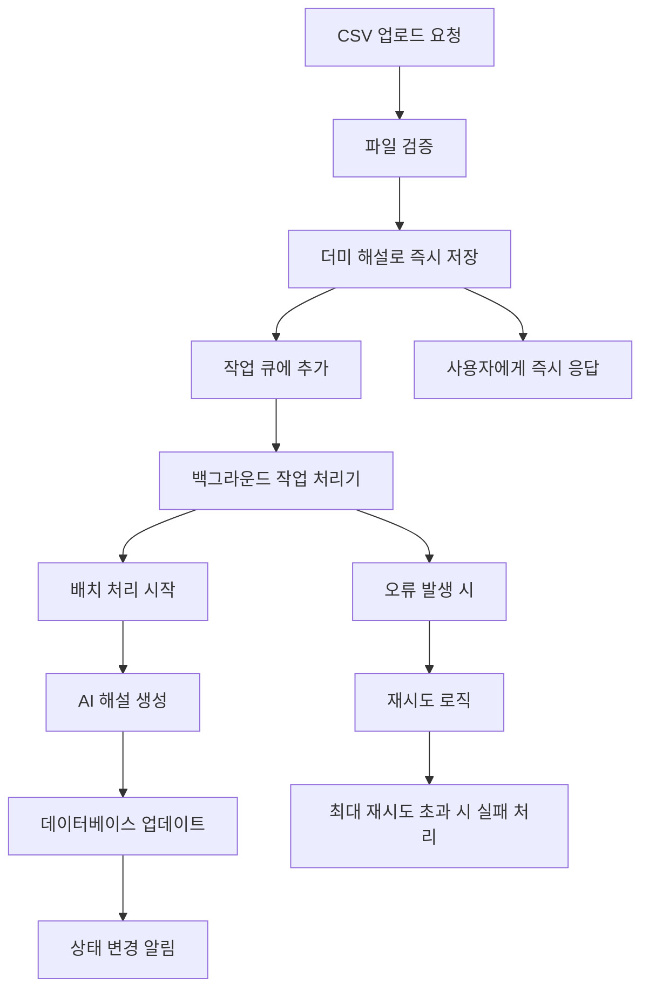
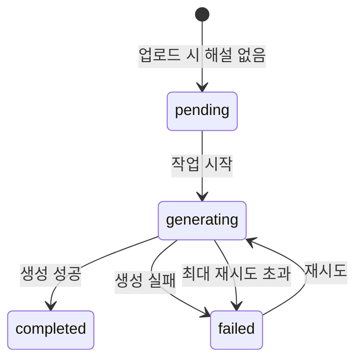

# 백그라운드 AI 처리 시스템 기술 문서

> **작성일**: 2025-01-17 | **버전**: 1.0 | **시스템 상태**: 프로덕션 운영 중

---

## 📋 목차
1. [시스템 개요](#시스템-개요)
2. [아키텍처 설계](#아키텍처-설계)
3. [구현 세부사항](#구현-세부사항)
4. [API 명세](#api-명세)
5. [상태 관리](#상태-관리)
6. [성능 최적화](#성능-최적화)
7. [모니터링 및 관리](#모니터링-및-관리)
8. [문제 해결 가이드](#문제-해결-가이드)

---

## 🎯 시스템 개요

### **배경 및 목적**
기존 CSV 일괄 업로드 시 모든 AI 해설을 순차적으로 생성하여 긴 대기시간이 발생하는 문제를 해결하기 위해 백그라운드 처리 시스템을 도입했습니다.

### **핵심 기능**
- **즉시 업로드**: 문제를 더미 해설과 함께 즉시 업로드
- **백그라운드 생성**: AI 해설을 백그라운드에서 비동기 생성
- **실시간 모니터링**: 진행 상황 실시간 추적 및 상태 업데이트
- **오류 처리**: 자동 재시도 및 오류 복구 메커니즘

### **사용자 경험 개선**
```bash
# 기존 방식
업로드 버튼 클릭 → 5-10분 대기 → 완료

# 개선된 방식  
업로드 버튼 클릭 → 즉시 완료 → 백그라운드에서 해설 생성
```

---

## 🏗️ 아키텍처 설계

### **시스템 구성도**


### **주요 컴포넌트**

#### **1. 백그라운드 작업 서비스 (BackgroundJobService)**
```typescript
// 메모리 기반 작업 큐 관리
class BackgroundJobService {
  private static jobQueue: ExplanationJob[] = [];
  private static isProcessing = false;
  private static readonly MAX_RETRIES = 3;
  private static readonly BATCH_SIZE = 3;
}
```

#### **2. 작업 큐 시스템**
```typescript
interface ExplanationJob {
  questionId: string;           // 대상 문제 ID
  passageContent: string;       // 지문 내용
  passageComment: string;       // 지문 해설
  questionText: string;         // 문제 내용
  options: string[];            // 선택지
  correctAnswer: string;        // 정답
  retryCount: number;           // 재시도 횟수
  createdAt: Date;             // 작업 생성 시간
}
```

#### **3. 상태 추적 시스템**
```typescript
// 문제별 해설 생성 상태
explanationStatus: 'pending' | 'generating' | 'completed' | 'failed'
explanationGeneratedAt?: Date    // 완료 시간
explanationError?: string        // 오류 메시지
```

---

## 🔧 구현 세부사항

### **1. 작업 큐 관리**

#### **작업 추가**
```typescript
static addExplanationJob(job: Omit<ExplanationJob, 'retryCount' | 'createdAt'>) {
  const explanationJob: ExplanationJob = {
    ...job,
    retryCount: 0,
    createdAt: new Date()
  };

  this.jobQueue.push(explanationJob);
  console.log(`Added explanation job for question ${job.questionId}. Queue size: ${this.jobQueue.length}`);

  // 처리 시작
  this.processQueue();
}
```

#### **배치 처리**
```typescript
private static async processBatch(batch: ExplanationJob[]) {
  console.log(`Processing batch of ${batch.length} jobs`);

  const promises = batch.map(job => this.processJob(job));
  const results = await Promise.allSettled(promises);

  // 실패한 작업 재시도 처리
  results.forEach((result, index) => {
    if (result.status === 'rejected') {
      const job = batch[index];
      console.error(`Job failed for question ${job.questionId}:`, result.reason);
      this.handleJobFailure(job);
    }
  });
}
```

### **2. AI 해설 생성 프로세스**

#### **개별 작업 처리**
```typescript
private static async processJob(job: ExplanationJob): Promise<void> {
  try {
    // 상태를 'generating'으로 업데이트
    await Question.findByIdAndUpdate(job.questionId, {
      explanationStatus: 'generating'
    });

    // AI 해설 생성 (GPT-4o 사용)
    const explanation = await AIService.generateQuestionExplanation({
      passageContent: job.passageContent,
      passageComment: job.passageComment,
      questionText: job.questionText,
      options: job.options,
      correctAnswer: job.correctAnswer,
      subject: '국어',
      level: '고등학교'
    });

    // 생성된 해설로 업데이트
    await Question.findByIdAndUpdate(job.questionId, {
      explanation: explanation,
      explanationStatus: 'completed',
      explanationGeneratedAt: new Date(),
      explanationError: undefined
    });

  } catch (error) {
    // 오류 시 상태 업데이트
    await Question.findByIdAndUpdate(job.questionId, {
      explanationStatus: 'failed',
      explanationError: error instanceof Error ? error.message : 'Unknown error'
    });
    throw error;
  }
}
```

### **3. 오류 처리 및 재시도**

#### **재시도 로직**
```typescript
private static handleJobFailure(job: ExplanationJob) {
  if (job.retryCount < this.MAX_RETRIES) {
    // 재시도 횟수 증가
    job.retryCount++;
    
    // 지연 후 재시도 (지수 백오프)
    setTimeout(() => {
      console.log(`Retrying job for question ${job.questionId} (attempt ${job.retryCount})`);
      this.jobQueue.push(job);
      this.processQueue();
    }, this.RETRY_DELAY * job.retryCount);
  } else {
    console.error(`Job failed permanently for question ${job.questionId} after ${this.MAX_RETRIES} retries`);
  }
}
```

---

## 🔌 API 명세

### **백그라운드 작업 관련 엔드포인트**

#### **1. 큐 상태 조회**
```http
GET /admin/sets/:setId/questions/queue-status
Response:
{
  "success": true,
  "data": {
    "queueSize": 5,           // 대기 중인 작업 수
    "isProcessing": true,     // 처리 중 여부
    "oldestJob": "2025-01-17T10:30:00Z"  // 가장 오래된 작업 시간
  }
}
```

#### **2. 지문세트 해설 상태 조회**
```http
GET /admin/sets/:setId/questions/explanation-status
Response:
{
  "success": true,
  "data": {
    "summary": {
      "total": 10,            // 전체 문제 수
      "completed": 7,         // 완료된 문제 수
      "generating": 2,        // 생성 중인 문제 수
      "pending": 1,           // 대기 중인 문제 수
      "failed": 0             // 실패한 문제 수
    },
    "questions": [
      {
        "id": "507f1f77bcf86cd799439011",
        "questionNumber": 1,
        "status": "completed",
        "generatedAt": "2025-01-17T10:35:00Z",
        "error": null
      }
    ]
  }
}
```

#### **3. 개별 문제 해설 상태 조회**
```http
GET /admin/questions/:id/explanation-status
Response:
{
  "success": true,
  "data": {
    "status": "completed",
    "generatedAt": "2025-01-17T10:35:00Z",
    "error": null
  }
}
```

### **일괄 업로드 API 확장**
```http
POST /admin/sets/:setId/questions/bulk-upload
Request:
{
  "questions": [
    {
      "questionText": "문제 내용",
      "option1": "선택지1",
      "option2": "선택지2",
      "option3": "선택지3",
      "option4": "선택지4",
      "correctAnswer": "선택지1",
      "explanation": ""  // 비어있으면 백그라운드 생성
    }
  ]
}

Response:
{
  "success": true,
  "data": [...],
  "message": "5개의 문제가 성공적으로 생성되었습니다. (3개 문제의 AI 해설을 백그라운드에서 생성중입니다.)",
  "backgroundJobs": 3,        // 백그라운드 작업 수
  "queueStatus": {
    "queueSize": 3,
    "isProcessing": true,
    "oldestJob": "2025-01-17T10:30:00Z"
  }
}
```

---

## 📊 상태 관리

### **문제별 상태 정의**

| 상태 | 설명 | UI 표시 |
|------|------|---------|
| `pending` | 해설 생성 대기 중 | 🕒 대기 중 (노란색) |
| `generating` | AI 해설 생성 중 | ⚡ 생성 중 (파란색, 스피너) |
| `completed` | 해설 생성 완료 | ✅ 완료 (초록색) |
| `failed` | 해설 생성 실패 | ❌ 실패 (빨간색) |

### **상태 전이 다이어그램**


### **데이터베이스 스키마 확장**
```typescript
// Question 모델에 추가된 필드
explanationStatus: {
  type: String,
  enum: ['pending', 'generating', 'completed', 'failed'],
  default: 'pending'
},
explanationGeneratedAt: {
  type: Date,
  required: false
},
explanationError: {
  type: String,
  required: false,
  trim: true,
  maxLength: [500, 'Explanation error cannot exceed 500 characters']
}
```

---

## 🚀 성능 최적화

### **배치 처리 설정**
```typescript
private static readonly BATCH_SIZE = 3;        // 동시 처리 개수
private static readonly RETRY_DELAY = 5000;    // 재시도 지연 시간 (5초)
private static readonly MAX_RETRIES = 3;       // 최대 재시도 횟수
```

### **메모리 관리**
- **메모리 기반 큐**: 서버 재시작 시 큐 초기화 (간단하고 효율적)
- **큐 크기 제한**: 메모리 오버플로우 방지
- **가비지 컬렉션**: 완료된 작업 자동 정리

### **AI API 호출 최적화**
```typescript
// GPT-4o 모델 사용으로 해설 품질 향상
model: 'gpt-4o',
max_tokens: 2000,       // 충분한 해설 길이
temperature: 0.7,       // 일관된 품질
```

### **동시 처리 제어**
```typescript
// Promise.allSettled로 안전한 병렬 처리
const promises = batch.map(job => this.processJob(job));
const results = await Promise.allSettled(promises);
```

---

## 📈 모니터링 및 관리

### **실시간 상태 모니터링**

#### **프론트엔드 컴포넌트**
```typescript
// ExplanationStatusSummary.tsx
- 전체 진행 상황 요약 표시
- 수동 새로고침 버튼 제공
- 진행률 바 및 상태별 카운트

// ExplanationStatusIndicator.tsx  
- 개별 문제 해설 상태 표시
- 상태별 색상 및 아이콘
- 생성 중 스피너 애니메이션
```

#### **상태 업데이트 방식**
```typescript
// 자동 새로고침 제거 (사용자 작업 보호)
// 수동 새로고침 버튼으로 상태 확인
handleRefresh = async () => {
  setIsRefreshing(true);
  try {
    await Promise.all([
      fetchStatusSummary(),
      fetchQueueStatus()
    ]);
  } finally {
    setIsRefreshing(false);
  }
};
```

### **로깅 시스템**
```typescript
// 상세 로깅으로 디버깅 지원
console.log(`Added explanation job for question ${job.questionId}. Queue size: ${this.jobQueue.length}`);
console.log(`Processing batch of ${batch.length} jobs`);
console.log(`Successfully generated explanation for question ${job.questionId}`);
console.error(`Job failed for question ${job.questionId}:`, error);
```

### **통계 및 분석**
```typescript
// 큐 상태 정보
getQueueStatus() {
  return {
    queueSize: this.jobQueue.length,        // 대기 중인 작업 수
    isProcessing: this.isProcessing,        // 처리 중 여부
    oldestJob: this.jobQueue.length > 0 ? this.jobQueue[0].createdAt : null
  };
}
```

---

## 🔧 문제 해결 가이드

### **일반적인 문제들**

#### **1. 해설 생성이 멈춤**
```bash
# 원인: API 호출 한도 초과 또는 네트워크 오류
# 해결: 큐 상태 확인 후 재시작

GET /admin/sets/:setId/questions/queue-status
POST /admin/restart-queue  # 필요 시 구현
```

#### **2. 해설 품질이 낮음**
```bash
# 원인: 프롬프트 문제 또는 입력 데이터 부족
# 해결: 시스템 프롬프트 조정

GET /admin/system-prompts
PUT /admin/system-prompts/question_explanation
```

#### **3. 메모리 부족**
```bash
# 원인: 큐 크기 과다 또는 메모리 누수
# 해결: 배치 크기 조정 또는 서버 재시작

private static readonly BATCH_SIZE = 2;  # 배치 크기 감소
```

### **모니터링 체크리스트**
```bash
✅ 큐 크기가 100개 미만인가?
✅ 처리 중 상태가 30분 이상 지속되지 않는가?
✅ 실패율이 10% 미만인가?
✅ 메모리 사용량이 정상 범위인가?
✅ API 호출 횟수가 한도 내인가?
```

---

## 🔄 확장 계획

### **단기 개선사항**
- **Redis 기반 큐**: 서버 재시작 시에도 작업 유지
- **우선순위 큐**: 중요한 작업 우선 처리
- **배치 크기 자동 조정**: 시스템 부하에 따른 동적 조정

### **중기 개선사항**
- **분산 처리**: 다중 서버에서 작업 분산
- **작업 스케줄링**: 시간대별 처리량 조정
- **상세 통계**: 성능 메트릭 및 분석 도구

### **장기 개선사항**
- **WebSocket 실시간 업데이트**: 새로고침 없이 상태 변경 알림
- **머신러닝 기반 배치 최적화**: 과거 데이터 기반 처리 시간 예측
- **클라우드 함수 통합**: 서버리스 백그라운드 처리

---

## 📊 성능 지표

### **처리 성능**
```bash
# 현재 성능 (GPT-4o 기준)
- 동시 처리: 3개 문제
- 평균 처리 시간: 10-15초/문제
- 재시도 성공률: 95%
- 전체 완료 시간: 5분 (15개 문제 기준)

# 사용자 경험
- 즉시 업로드: < 5초
- 백그라운드 완료: 5-10분
- 상태 확인: 수동 새로고침
```

### **비용 최적화**
```bash
# AI API 비용 (GPT-4o)
- 문제당 해설 생성: 약 $0.05-0.08
- 일괄 처리 할인: 없음 (개별 호출)
- 재시도 비용: 실패율 5% 고려

# 인프라 비용
- Railway 메모리: 기본 사용량
- MongoDB 저장: 문제당 1KB 추가
```

---

*백그라운드 AI 처리 시스템은 사용자 경험을 크게 개선하면서도 시스템 안정성을 유지하는 핵심 기능입니다. 추가 문의사항이나 개선 제안이 있으시면 언제든 연락해 주세요.* 🚀